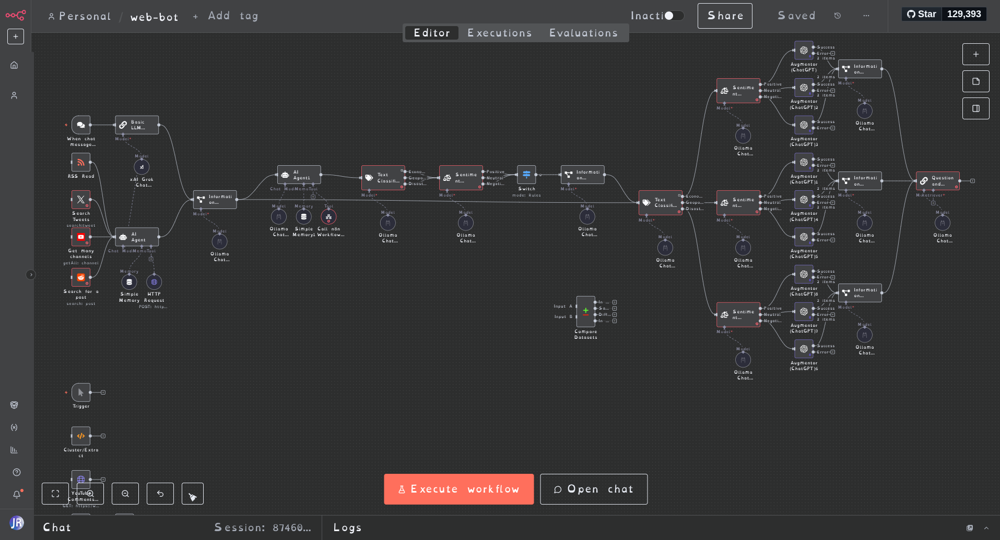

# Predictive Linguistics WebBot (n8n-powered)

A multi-agent, cross-platform **n8n** workflow for detecting, tracking, and synthesizing emergent metaphors, archetypes, and “future leaks” in social and news media—built in the spirit of Clif High’s predictive linguistics.

---

🌐 **Overview**  
Predictive Linguistics WebBot is an **open-source, n8n-driven automation system** that harvests and analyzes linguistic signals from multiple platforms (X/Twitter, Reddit, YouTube, public news comments). It surfaces novel archetypes, emotional spikes, contradictions, and “future-leak” indicators.  
Using **n8n’s node-based orchestration**, the workflow runs parallel LLM pipelines, cross-validates signals across platforms, and synthesizes findings into machine- and human-readable formats.


*Full n8n multi-agent pipeline for data harvesting, classification, synthesis, and reporting.*


---

🚀 **Features**  

- **Built on n8n** – native JSON workflow exports for easy import, editing, and deployment
- Harvests data from X, Reddit, YouTube, and public news comments
- Detects metaphors, archetypes, and emerging linguistic patterns
- Cross-validates signals across platforms (delta detection)
- Synthesizes findings using local and cloud LLMs
- Outputs Markdown, JSON, and audio summaries
- *(Future)* Weekly digests, timeline charts, and mobile notifications

---

📂 **Project Structure**  
workflows/ # n8n workflow JSON exports
scripts/ # Python/Node scripts for scraping, clustering, etc.
prompts/ # LLM/augmentor prompt templates
docs/ # Architecture, rationale, usage notes
samples/ # Sample outputs and file formats
.env.example # Sample environment config for API keys
PORTS.md # Port reference for services

---

⚙️ **Quickstart**

1. **Clone the repo**
```bash
git clone https://github.com/<your-username>/predictive-linguistics-webbot.git
cd predictive-linguistics-webbot
Copy and configure environment


cp .env.example .env
Fill in API keys for X, Reddit, YouTube, OpenAI, DeepSeek, etc.

Import the workflow into n8n

Open your self-hosted or cloud n8n GUI

Import from workflows/

Configure credentials as needed

Run optional scripts


python3 scripts/your_script.py
🛠️ Requirements

n8n (self-hosted or n8n.cloud — free/community edition supported)

Python 3.9+ (for scripts)

Node.js (if using Node-based scripts)

API keys for data sources (see .env.example)

Local LLM (DeepSeek, optional for full privacy)

🤝 Collaboration & Contribution

Fork this repo and open PRs for improvements or new n8n workflows

Share feedback via issues or discussion threads

Workflows and prompt templates are modular—share and remix freely

📜 License

MIT — feel free to relicense for your own use.

Inspired by Clif High’s predictive linguistics and meme tracking research.
Built by Paul and collaborators—open for improvement!

---

If you save this into your repo with:

```bash
micro README.md
(paste it in, save, and exit), then:

bash
Copy
Edit
git add README.md
git commit -m "Rewrite README to emphasize n8n-powered architecture"
git push